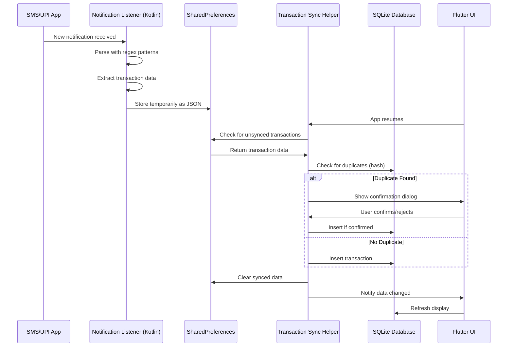
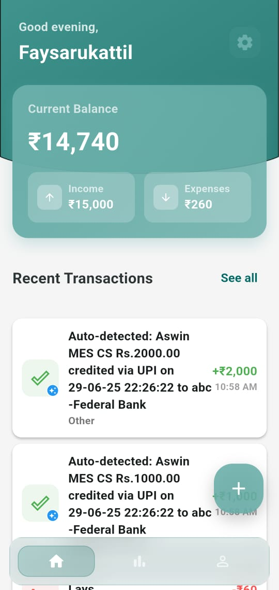
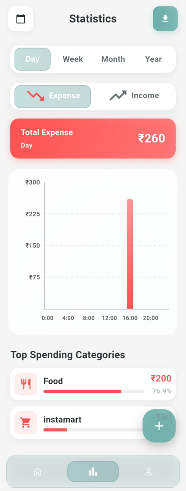
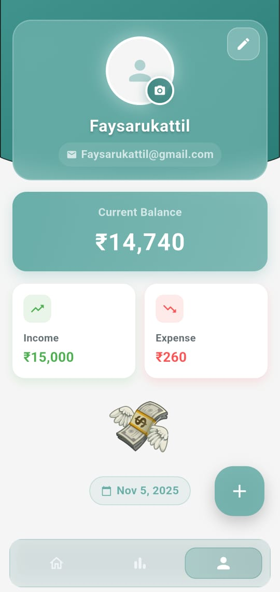
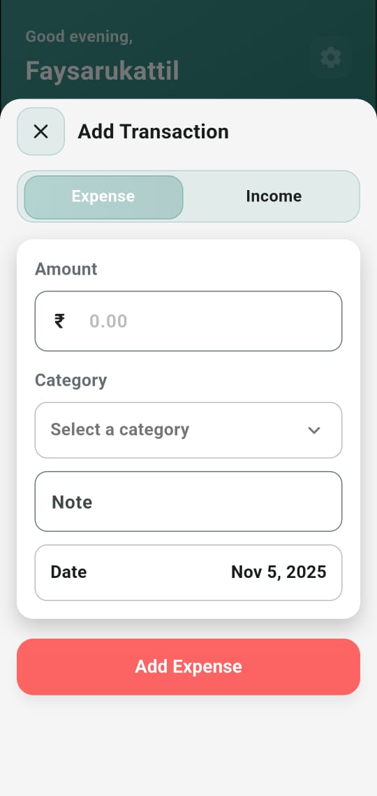
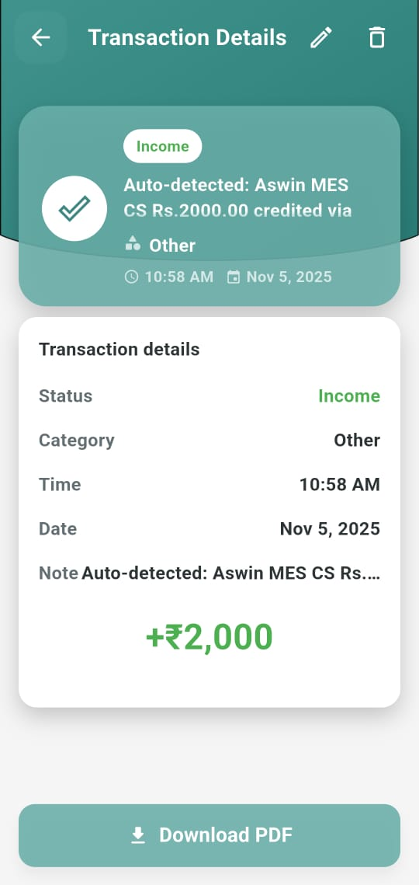
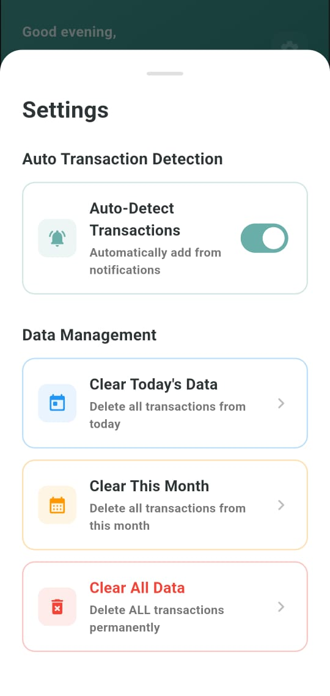
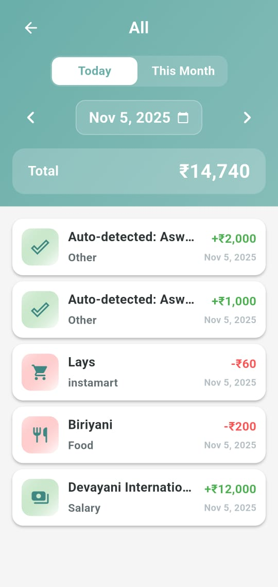
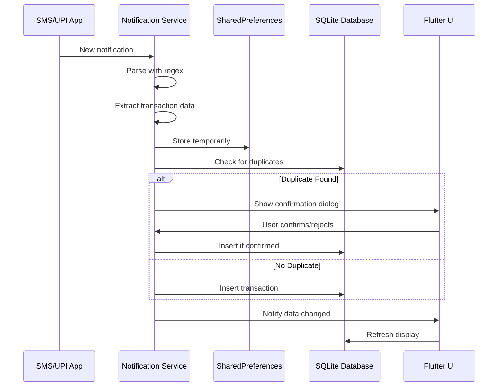
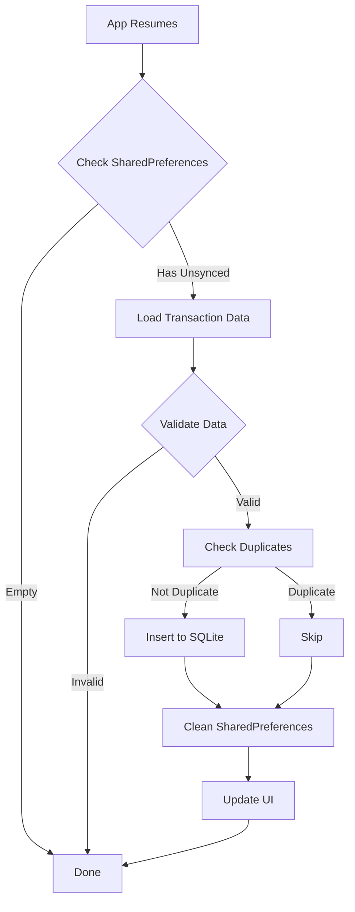

# 💰 Buddy - Smart Expense Tracker

<div align="center">
  
  
  
  
  
  
  
  **Your intelligent companion for effortless expense management**
  
  [Features](#-features) • [Installation](#️-installation) • [Architecture](#️-architecture) • [Authentication](#-authentication) • [Screenshots](#-screenshots) • [Contributing](#-contributing)
</div>

---

## 📖 About

Buddy is a modern, feature-rich expense tracker app built with Flutter that revolutionizes personal finance management through intelligent automation. With advanced notification parsing, background processing, and secure Firebase authentication, Buddy automatically captures your transactions from SMS and UPI notifications - even when the app is closed - making expense tracking truly effortless.

## 🎯 Key Highlights

- 🔐 **Secure Authentication**: Firebase-powered sign-in with Google, Email/Password, and Anonymous Signin
- 🤖 **Smart Auto-Detection**: Automatically extracts transaction data from SMS/UPI notifications using advanced regex patterns
- 📱 **Background Processing**: Captures transactions even when the app is closed via native Android service
- 🔄 **Intelligent Deduplication**: Prevents duplicate entries with hash-based comparison and user confirmation
- 📊 **Rich Analytics**: Beautiful charts and insights with daily, weekly, monthly, and yearly views
- 💾 **Local-First Storage**: Fast and secure SQLite database with no internet dependency
- 🎨 **Modern UI/UX**: Smooth animations, glassmorphism effects, and intuitive gestures
- 📄 **PDF Export**: Generate professional transaction reports with a single tap

---

## ✨ Features

### 🔐 Authentication & Security

| Feature | Description |
|---------|-------------|
| **Google Sign-In** | Quick and secure authentication using your Google account |
| **Email/Password** | Traditional sign-up and login with email verification |
| **Anonymous Sign-In** | Try the app instantly without creating an account |
| **Secure Sessions** | Firebase handles token management and session security |
| **Easy Account Linking** | Convert anonymous accounts to permanent accounts later |

### 🚀 Core Features

| Feature | Description |
|---------|-------------|
| **Auto Transaction Detection** | Automatically parses SMS and UPI notifications to extract transaction details |
| **Background Service** | Native Android service runs continuously to capture notifications when app is closed |
| **Smart Categorization** | AI-powered category detection based on transaction notes and merchant names |
| **Duplicate Prevention** | Advanced hash-based deduplication with user confirmation for similar transactions |
| **Real-time Sync** | Instant sync from background service to app database when app resumes |
| **Manual Entry** | Quick add transactions with custom categories and notes |

### 📊 Analytics & Insights

- **Interactive Charts**: Beautiful bar charts powered by FL Chart
- **Multiple Views**: Daily, Weekly, Monthly, and Yearly statistics
- **Category Breakdown**: Top spending/earning categories with percentages
- **Balance Tracking**: Real-time income, expense, and balance calculations
- **Date Navigation**: Smooth swipe gestures to navigate between time periods

### 💾 Data Management

- **Local Storage**: SQLite database for fast, offline-first data access
- **Transaction History**: Complete audit trail with timestamps and sources
- **Filtering**: Filter transactions by type (income/expense) and date
- **Search**: Quick search through transaction history
- **PDF Export**: Generate professional reports for any time period
- **Data Cleanup**: Selective deletion (today, this month, or all data)

### 🎨 User Experience

- **Glassmorphism Design**: Modern, translucent UI elements
- **Smooth Animations**: Polished transitions and micro-interactions with Lottie
- **Gesture Controls**: Swipe navigation between tabs and time periods
- **Pull to Refresh**: Refresh data with intuitive pull gesture
- **Dark Mode Ready**: Adaptive color scheme (customizable)
- **Responsive Layout**: Optimized for various screen sizes

---

## 🛠️ Installation

### Prerequisites

- Flutter SDK: `>=3.9.2`
- Dart SDK: `>=3.9.2`
- Android Studio or VS Code
- Android device/emulator (API level 21+)
- Firebase account (for authentication)

### Steps

1. **Clone the repository**

```bash
git clone https://github.com/FaysArukattil/faysarukattil-buddy.git
cd faysarukattil-buddy
```

2. **Install dependencies**

```bash
flutter pub get
```

3. **Firebase Setup**

   a. Create a Firebase project at [Firebase Console](https://console.firebase.google.com/)
   
   b. Add an Android app to your Firebase project
   
   c. Download `google-services.json` and place it in `android/app/`
   
   d. Enable Authentication methods in Firebase Console:
      - Go to Authentication → Sign-in method
      - Enable **Google**, **Email/Password**, and **Anonymous**
   
   e. For Google Sign-In, add your SHA-1 certificate fingerprint:
   
   ```bash
   # Get your SHA-1
   keytool -list -v -keystore ~/.android/debug.keystore -alias androiddebugkey -storepass android -keypass android
   ```
   
   Add the SHA-1 in Firebase Console → Project Settings → Your apps → SHA certificate fingerprints

4. **Configure Android permissions**

The required permissions are already configured in `android/app/src/main/AndroidManifest.xml`:

```xml
<uses-permission android:name="android.permission.POST_NOTIFICATIONS"/>
<uses-permission android:name="android.permission.BIND_NOTIFICATION_LISTENER_SERVICE"/>
<uses-permission android:name="android.permission.INTERNET"/>
<uses-permission android:name="android.permission.RECEIVE_SMS"/>
<uses-permission android:name="android.permission.READ_SMS"/>
```

5. **Run the app**

```bash
flutter run
```

6. **Enable notification access**
   - Navigate to Settings → Notification Access
   - Find "Buddy" and toggle it ON
   - This allows the app to read SMS/UPI notifications

---

## 🏗️ Architecture

### Project Structure

```
lib/
├── main.dart                          # App entry point with Firebase initialization
├── firebase_options.dart              # Auto-generated Firebase configuration
│
├── models/                            # Data models
│   ├── transaction.dart              # Transaction model with auto-detection support
│   ├── category.dart                 # Category model for categorization
│   └── bill.dart                     # Bill/recurring payment model
│
├── services/                          # Business logic & core services
│   ├── auth_service.dart             # Firebase authentication logic
│   ├── notification_service.dart     # Notification listener & parser
│   ├── notification_helper.dart      # Local notification manager
│   ├── transaction_sync_helper.dart  # Background to foreground sync
│   ├── app_init_helper.dart          # App initialization & lifecycle
│   ├── db_helper.dart                # SQLite database operations
│   ├── pdf_service.dart              # PDF generation & export
│   └── Network_services.dart         # Network connectivity checks
│
├── repositories/                      # Data access layer
│   └── transaction_repository.dart   # Transaction CRUD operations
│
├── views/
│   ├── screens/                      # Application screens
│   │   ├── onboarding/              # Onboarding flow
│   │   │   ├── splashscreen/
│   │   │   │   └── splash_screen.dart
│   │   │   ├── auth_wrapper.dart
│   │   │   ├── login_screen.dart
│   │   │   ├── signup_screen.dart
│   │   │   └── onborading_screen.dart
│   │   │
│   │   ├── bottomnavbarscreen/      # Main app screens
│   │   │   ├── bottom_navbar_screen.dart  # Main navigation container
│   │   │   ├── home_screen.dart           # Home screen
│   │   │   ├── statistics_screen.dart     # Analytics & charts
│   │   │   └── profile_screen.dart        # User profile & settings
│   │   │
│   │   ├── add_transaction_screen.dart        # Manual transaction entry
│   │   ├── filtered_transactions_screen.dart  # Filtered transaction list
│   │   └── transaction_detail_screen.dart     # Transaction details view
│   │
│   └── widgets/                      # Screen-specific widgets
│       ├── auth_textfield.dart       # Custom text field for auth
│       ├── balance_card.dart         # Balance display card
│       ├── custom_button_filled.dart # Primary button
│       ├── custom_button_outlined.dart # Secondary button
│       ├── setting_modal.dart        # Settings modal dialog
│       └── transaction_card.dart     # Transaction list item
│       └── animated_money_text.dart  # Animated currency display                    
│     
└── utils/                            # Utilities & constants
    ├── colors.dart                   # App color scheme
    ├── format_utils.dart             # Currency & date formatting
    ├── images.dart                   # Asset paths & image utilities
    ├── budget_manager.dart           # Budget tracking logic
    ├── export_manager.dart           # Data export utilities
    └── notification_test_helper.dart # Testing utilities for notifications

android/
└── app/src/main/kotlin/com/example/buddy/
    ├── MainActivity.kt                    # Flutter activity
    ├── NotificationListener.kt            # Background notification service
    ├── NotificationActionReciever.kt      # Handles notification actions
    ├── BootReciever.kt                    # Starts service on device boot
    └── DuplicateConfirmationActivity.kt   # Handles duplicate confirmations

assets/
├── icon/                             # App icons
├── images/                           # Static images
└── lottie/
    └── jsonlottie/                   # Lottie animation files
        ├── Coinlottie.json
        └── Moneylottie.json
```

### Key Components

#### 1. Authentication Service (`auth_service.dart`)

Manages all Firebase authentication operations:
- Google Sign-In integration
- Email/password authentication
- Anonymous user sessions
- Account linking functionality
- Authentication state monitoring

#### 2. Notification System

**NotificationListener.kt** (Android Native):
- Listens to system notifications via Android NotificationListenerService
- Parses transaction data using regex patterns
- Stores data in SharedPreferences for Flutter access
- Runs continuously in background

**notification_service.dart** (Flutter):
- Bridges Android service with Flutter app
- Manages notification permissions
- Handles notification parsing logic

**notification_helper.dart**:
- Shows local notifications for confirmations
- Handles user interactions with notifications

#### 3. Transaction Sync (`transaction_sync_helper.dart`)

- Syncs transactions from SharedPreferences to SQLite on app resume
- Prevents duplicate processing with hash-based comparison
- Batches operations for performance
- Manages app lifecycle events

#### 4. Database Layer (`db_helper.dart`)

- SQLite database with indexed queries
- Auto-migration support for schema changes
- Transaction deduplication using notification hash
- Efficient timestamp-based filtering
- User-specific data isolation

#### 5. Native Android Components

**BootReceiver.kt**: Automatically starts notification listener service on device boot

**NotificationActionReceiver.kt**: Handles actions from notification buttons

**DuplicateConfirmationActivity.kt**: Shows UI for duplicate transaction confirmation

#### 6. Smart Parsing Algorithm

The app uses sophisticated regex patterns to extract transaction information:

```dart
// Example parsing patterns
RegExp debitRegex = RegExp(r'\b(debited|spent|purchase|paid)\b');
RegExp creditRegex = RegExp(r'\b(credited|received|deposit)\b');
RegExp amountRegex = RegExp(r'(?:Rs\.?|₹)\s?([0-9,]+\.?[0-9]*)');
```

Extracts: amount, type (income/expense), category, merchant, and timestamp.

---

## 🔐 Authentication

Buddy uses **Firebase Authentication** to provide secure, flexible sign-in options.

### Supported Authentication Methods

#### 1. 🔵 Google Sign-In

One-tap authentication using your Google account.

**Implementation Details:**
- Uses `google_sign_in` package for native Google authentication
- Automatically retrieves user profile information (name, email, photo)
- Provides seamless sign-in experience with no manual data entry

**User Flow:**
```
User taps "Sign in with Google" 
→ Google account picker appears 
→ User selects account 
→ Instant authentication 
→ Redirect to home screen
```

#### 2. 📧 Email/Password Sign-In

Traditional authentication with email and password.

**Features:**
- **Sign Up**: Create new account with email validation
- **Sign In**: Secure login with encrypted password
- **Password Reset**: Email-based password recovery
- **Email Verification**: Optional email verification for added security

**User Flow:**
```
New User: Enter email & password → Create account → Verify email (optional) → Sign in
Existing User: Enter credentials → Authenticate → Redirect to home screen
Forgot Password: Enter email → Receive reset link → Set new password
```

#### 3. 👤 Anonymous Sign-In

Try the app instantly without creating an account.

**Features:**
- **Instant Access**: Start using the app immediately
- **Local Data**: All transactions saved locally
- **Account Upgrade**: Convert to permanent account later
- **Privacy First**: No personal information required

**User Flow:**
```
User taps "Continue as Guest" 
→ Anonymous session created instantly 
→ Full app access 
→ Optional: Convert to permanent account later
```

### Security Features

- **Encrypted Passwords**: All passwords hashed and encrypted by Firebase
- **Secure Token Management**: Firebase handles session tokens automatically
- **Auto Session Refresh**: Tokens refreshed automatically for seamless experience
- **Secure Sign Out**: Complete session termination on logout
- **Account Linking**: Upgrade anonymous accounts without data loss

### Account Management

Users can:
- View current authentication method in Profile screen
- Sign out from any device
- Delete account (removes all cloud data)
- Link anonymous account to permanent email/Google account
- Change password (for email/password accounts)
- Update profile information (name, photo)

---

## 🚀 How It Works

### Auto-Detection Flow



### Data Sync on App Resume

The `transaction_sync_helper.dart` automatically syncs pending transactions when the app resumes from background.

---

## 🎯 Supported Transaction Formats

Buddy intelligently parses various transaction notification formats:

### UPI Transactions

```
✅ Rs.500 debited from your A/c for UPI transaction
✅ You paid Rs.1,250 to AMAZON via PhonePe
✅ ₹350 sent to John Doe via Google Pay
```

### Bank SMS

```
✅ Your A/C XX1234 debited by Rs.2,000 on 01-Jan-2025
✅ A/C XX5678 credited with Rs.5,000 towards Salary
✅ INR 750.00 debited for online purchase
```

### Wallet Notifications

```
✅ Paytm: Rs.200 paid to Swiggy
✅ PhonePe: You received Rs.500 from Jane
```

---

## 📸 Screenshots

<div align="center">
  <table>
    <tr>
      <td></td>
      <td></td>
      <td></td>
    </tr>
    <tr>
      <td align="center"><b>Home Screen</b></td>
      <td align="center"><b>Analytics</b></td>
      <td align="center"><b>Profile</b></td>
    </tr>
    <tr>
      <td></td>
      <td></td>
      <td></td>
    </tr>
    <tr>
      <td align="center"><b>Add Transaction</b></td>
      <td align="center"><b>Details View</b></td>
      <td align="center"><b>Settings</b></td>
    </tr>
    <tr>
      <td></td>
    </tr>
    <tr>
      <td align="center"><b>All Transactions</b></td>
    </tr>
  </table>
</div>

---

## 📦 Dependencies

### Core Dependencies

```yaml
flutter: sdk
sqflite: ^2.3.3              # Local SQLite database
shared_preferences: ^2.5.3    # Key-value storage for temp data
path_provider: ^2.1.3         # File system paths
```

### Firebase & Authentication

```yaml
firebase_core: ^3.8.1         # Firebase initialization
firebase_auth: ^5.3.3         # Firebase authentication
google_sign_in: ^6.2.2        # Google Sign-In integration
```

### UI & Visualization

```yaml
fl_chart: ^0.68.0            # Beautiful charts for analytics
lottie: ^3.3.2               # Animated illustrations
image_picker: ^1.1.2         # Profile picture selection
```

### Notification Handling

```yaml
notification_listener_service: ^0.3.3  # Listen to system notifications
flutter_local_notifications: ^19.5.0   # Show confirmation notifications
permission_handler: ^11.3.1            # Runtime permissions
```

### Export & Sharing

```yaml
pdf: ^3.11.1                 # PDF generation
printing: ^5.13.2            # PDF preview & print
open_file: ^3.5.7           # Open PDF files
share_plus: ^7.2.2          # Share functionality
```

### Utilities

```yaml
crypto: ^3.0.3              # Hashing for deduplication
intl: ^0.19.0               # Date/time formatting
path: ^1.9.1                # Path manipulation
```

---

## 🔧 Configuration

### Firebase Configuration

The project includes auto-generated `firebase_options.dart` for Firebase initialization. Ensure you have:

1. Added your `google-services.json` to `android/app/`
2. Configured Firebase Authentication in the console
3. Added SHA-1 fingerprint for Google Sign-In

### Android Configuration

#### Notification Listener Service

The `NotificationListener.kt` service is already configured in `AndroidManifest.xml`:

```xml
<service
    android:name=".NotificationListener"
    android:permission="android.permission.BIND_NOTIFICATION_LISTENER_SERVICE"
    android:exported="true">
    <intent-filter>
        <action android:name="android.service.notification.NotificationListenerService" />
    </intent-filter>
</service>
```

#### Boot Receiver

Automatically starts the service on device boot:

```xml
<receiver
    android:name=".BootReciever"
    android:enabled="true"
    android:exported="true">
    <intent-filter>
        <action android:name="android.intent.action.BOOT_COMPLETED" />
    </intent-filter>
</receiver>
## 🚀 How It Works

### Auto-Detection Flow



### Data Sync on App Resume



---

## 🎯 Supported Transaction Formats

Buddy intelligently parses various transaction notification formats:

### UPI Transactions

```
✅ Rs.500 debited from your A/c for UPI transaction
✅ You paid Rs.1,250 to AMAZON via PhonePe
✅ ₹350 sent to John Doe via Google Pay
```

### Bank SMS

```
✅ Your A/C XX1234 debited by Rs.2,000 on 01-Jan-2025
✅ A/C XX5678 credited with Rs.5,000 towards Salary
✅ INR 750.00 debited for online purchase
```

### Wallet Notifications

```
✅ Paytm: Rs.200 paid to Swiggy
✅ PhonePe: You received Rs.500 from Jane
```
```

---

## 🤝 Contributing

Contributions are welcome! Please follow these steps:

1. **Fork the repository**

2. **Create a feature branch**

```bash
git checkout -b feature/amazing-feature
```

3. **Commit your changes**

```bash
git commit -m 'Add amazing feature'
```

4. **Push to the branch**

```bash
git push origin feature/amazing-feature
```

5. **Open a Pull Request**

### Development Guidelines

- Follow Flutter/Dart style guide
- Write meaningful commit messages
- Add comments for complex logic
- Test on multiple devices before PR
- Update documentation if needed
- Test authentication flows thoroughly
- Ensure Firebase configuration is documented
- Test background service functionality

---

## 🐛 Known Issues & Limitations

- Background service may stop on aggressive battery optimization (disable battery optimization for the app)
- Some banking apps use encrypted notifications that cannot be parsed
- Notification format variations may require regex pattern updates
- Google Sign-In requires valid SHA-1 certificate fingerprint in Firebase Console

---


---

## 🙏 Acknowledgments

- [Firebase](https://firebase.google.com/) for authentication and backend services
- [FL Chart](https://github.com/imaNNeoFighT/fl_chart) for beautiful charts
- [Lottie](https://airbnb.design/lottie/) for animations
- [Material Design](https://material.io/) for design guidelines
- Flutter Community for support and resources

---

## 👨‍💻 Author

**Fays Arukattil**

- GitHub: [@FaysArukattil](https://github.com/FaysArukattil)
- LinkedIn: [FaysArukattil](https://linkedin.com/in/FaysArukattil)
- Email: faysarukattil@gmail.com

---

## ⭐ Show Your Support

If you found this project helpful, please give it a ⭐ on GitHub!

---

<div align="center">
  <sub>Built with ❤️ using Flutter & Firebase</sub>
</div>
