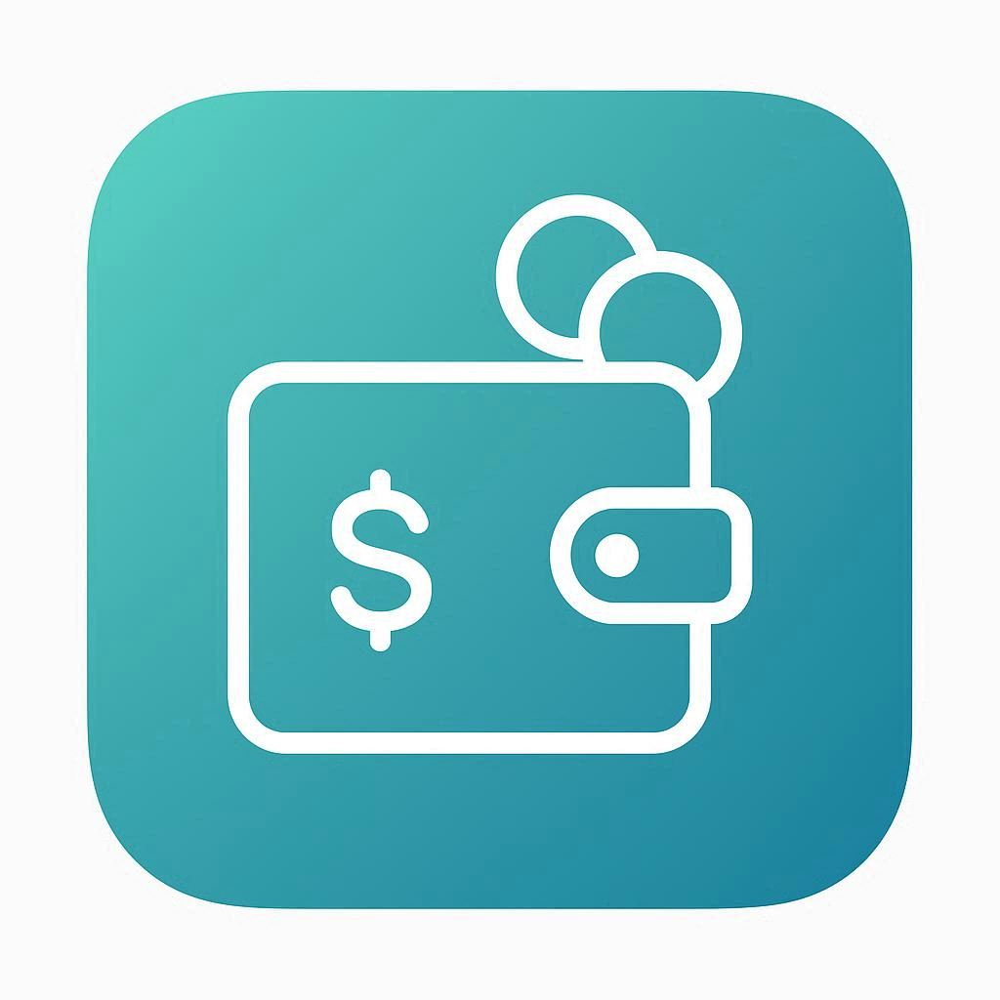

# 💰 Buddy - Smart Expense Tracker

<div align="center">
  
  
  
  
  
  
  
  **Your intelligent companion for effortless expense management**
  
  [Features](#-features) • [Installation](#️-installation) • [Architecture](#️-architecture) • [Screenshots](#-screenshots) • [Contributing](#-contributing)
</div>

---

## 📖 About

Buddy is a modern, feature-rich expense tracker app built with Flutter that revolutionizes personal finance management through intelligent automation. With advanced notification parsing and background processing, Buddy automatically captures your transactions from SMS and UPI notifications - even when the app is closed - making expense tracking truly effortless.

## 🎯 Key Highlights

- 🤖 **Smart Auto-Detection**: Automatically extracts transaction data from SMS/UPI notifications using advanced regex patterns
- 📱 **Background Processing**: Captures transactions even when the app is closed via native Android service
- 🔄 **Intelligent Deduplication**: Prevents duplicate entries with hash-based comparison and user confirmation
- 📊 **Rich Analytics**: Beautiful charts and insights with daily, weekly, monthly, and yearly views
- 💾 **Local-First Storage**: Fast and secure SQLite database with no internet dependency
- 🎨 **Modern UI/UX**: Smooth animations, glassmorphism effects, and intuitive gestures
- 📄 **PDF Export**: Generate professional transaction reports with a single tap

---

## ✨ Features

### 🚀 Core Features

| Feature | Description |
|---------|-------------|
| **Auto Transaction Detection** | Automatically parses SMS and UPI notifications to extract transaction details |
| **Background Service** | Native Android service runs continuously to capture notifications when app is closed |
| **Smart Categorization** | AI-powered category detection based on transaction notes and merchant names |
| **Duplicate Prevention** | Advanced hash-based deduplication with user confirmation for similar transactions |
| **Real-time Sync** | Instant sync from background service to app database when app resumes |
| **Manual Entry** | Quick add transactions with custom categories and notes |

### 📊 Analytics & Insights

- **Interactive Charts**: Beautiful bar charts powered by FL Chart
- **Multiple Views**: Daily, Weekly, Monthly, and Yearly statistics
- **Category Breakdown**: Top spending/earning categories with percentages
- **Balance Tracking**: Real-time income, expense, and balance calculations
- **Date Navigation**: Smooth swipe gestures to navigate between time periods

### 💾 Data Management

- **Local Storage**: SQLite database for fast, offline-first data access
- **Transaction History**: Complete audit trail with timestamps and sources
- **Filtering**: Filter transactions by type (income/expense) and date
- **Search**: Quick search through transaction history
- **PDF Export**: Generate professional reports for any time period
- **Data Cleanup**: Selective deletion (today, this month, or all data)

### 🎨 User Experience

- **Glassmorphism Design**: Modern, translucent UI elements
- **Smooth Animations**: Polished transitions and micro-interactions
- **Gesture Controls**: Swipe navigation between tabs and time periods
- **Pull to Refresh**: Refresh data with intuitive pull gesture
- **Dark Mode Ready**: Adaptive color scheme (customizable)
- **Responsive Layout**: Optimized for various screen sizes

---

## 🛠️ Installation

### Prerequisites

- Flutter SDK: `>=3.9.2`
- Dart SDK: `>=3.9.2`
- Android Studio or VS Code
- Android device/emulator (API level 21+)

### Steps

1. **Clone the repository**

```bash
git clone https://github.com/yourusername/buddy-expense-tracker.git
cd buddy-expense-tracker
```

2. **Install dependencies**

```bash
flutter pub get
```

3. **Configure Android permissions**

Ensure these permissions are in `android/app/src/main/AndroidManifest.xml`:

```xml
<uses-permission android:name="android.permission.POST_NOTIFICATIONS"/>
<uses-permission android:name="android.permission.BIND_NOTIFICATION_LISTENER_SERVICE"/>
```

4. **Run the app**

```bash
flutter run
```

5. **Enable notification access**
   - Navigate to Settings → Notification Access
   - Find "Buddy" and toggle it ON
   - This allows the app to read SMS/UPI notifications

---

## 🏗️ Architecture

### Project Structure

```
lib/
├── main.dart                          # App entry point with initialization
├── models/                            # Data models
│   ├── transaction.dart              # Transaction model with auto-detection support
│   ├── category.dart                 # Category model
│   └── bill.dart                     # Bill/recurring payment model
├── services/                          # Business logic & services
│   ├── notification_service.dart     # Notification listener & parser
│   ├── notification_helper.dart      # Local notification manager
│   ├── transaction_sync_helper.dart  # Background to foreground sync
│   ├── app_init_helper.dart         # App initialization & lifecycle
│   ├── db_helper.dart               # SQLite database operations
│   └── pdf_service.dart             # PDF generation & export
├── repositories/                      # Data access layer
│   └── transaction_repository.dart   # Transaction CRUD operations
├── views/
│   ├── screens/                      # UI screens
│   │   ├── onboarding/              # Splash, login, signup
│   │   ├── bottomnavbarscreen/      # Main app screens (home, stats, profile)
│   │   ├── add_transaction_screen.dart
│   │   ├── transaction_detail_screen.dart
│   │   └── filtered_transactions_screen.dart
│   └── widgets/                      # Reusable UI components
└── utils/                            # Utilities & constants
    ├── colors.dart                   # App color scheme
    ├── format_utils.dart            # Currency & date formatting
    └── images.dart                   # Asset paths
```

### Key Components

#### 1. Notification Service (`notification_service.dart`)

- Listens to system notifications via `notification_listener_service` package
- Parses transaction data using regex patterns
- Identifies income vs expense transactions
- Extracts amount, merchant, and transaction type
- Runs continuously in background via native Android service

#### 2. Transaction Sync (`transaction_sync_helper.dart`)

- Syncs transactions from native SharedPreferences to SQLite
- Handles app resume lifecycle to fetch pending transactions
- Prevents duplicate processing with hash-based comparison
- Batches operations for performance

#### 3. Database Layer (`db_helper.dart`)

- SQLite database with indexed queries for performance
- Auto-migration support for schema changes
- Transaction deduplication using notification hash
- Efficient timestamp-based filtering

#### 4. Smart Parsing Algorithm

```dart
// Example of transaction parsing logic
RegExp debitRegex = RegExp(r'\b(debited|spent|purchase|paid)\b');
RegExp creditRegex = RegExp(r'\b(credited|received|deposit)\b');
RegExp amountRegex = RegExp(r'(?:Rs\.?|₹)\s?([0-9,]+\.?[0-9]*)');

// Extracts: amount, type (income/expense), category, merchant
```

---

## 📸 Screenshots

<div align="center">
  <table>
    <tr>
      <td></td>
      <td></td>
      <td></td>
    </tr>
    <tr>
      <td align="center"><b>Home Screen</b></td>
      <td align="center"><b>Analytics</b></td>
      <td align="center"><b>Profile</b></td>
    </tr>
    <tr>
      <td></td>
      <td></td>
      <td></td>
    </tr>
    <tr>
      <td align="center"><b>Add Transaction</b></td>
      <td align="center"><b>Details View</b></td>
      <td align="center"><b>Settings</b></td>
    </tr>
  </table>
</div>

---

## 📦 Dependencies

### Core Dependencies

```yaml
flutter: sdk
sqflite: ^2.3.3              # Local SQLite database
shared_preferences: ^2.5.3    # Key-value storage
path_provider: ^2.1.3         # File system paths
```

### UI & Visualization

```yaml
fl_chart: ^0.68.0            # Beautiful charts
lottie: ^3.3.2               # Animated illustrations
image_picker: ^1.1.2         # Profile picture selection
```

### Notification Handling

```yaml
notification_listener_service: ^0.3.3  # Listen to system notifications
flutter_local_notifications: ^19.5.0   # Show confirmation notifications
permission_handler: ^11.3.1            # Runtime permissions
```

### Export & Sharing

```yaml
pdf: ^3.11.1                 # PDF generation
printing: ^5.13.2            # PDF preview & print
open_file: ^3.5.7           # Open PDF files
share_plus: ^7.2.2          # Share functionality
```

### Utilities

```yaml
crypto: ^3.0.3              # Hashing for deduplication
intl: ^0.19.0               # Date/time formatting
path: ^1.9.1                # Path manipulation
```

---

## 🔧 Configuration

### Android Setup

#### 1. Notification Listener Service

Add service declaration in `AndroidManifest.xml`:

```xml
<service
    android:name=".NotificationListener"
    android:permission="android.permission.BIND_NOTIFICATION_LISTENER_SERVICE"
    android:exported="true">
    <intent-filter>
        <action android:name="android.service.notification.NotificationListenerService" />
    </intent-filter>
</service>
```

#### 2. Permissions

```xml
<uses-permission android:name="android.permission.POST_NOTIFICATIONS"/>
<uses-permission android:name="android.permission.RECEIVE_SMS"/>
<uses-permission android:name="android.permission.READ_SMS"/>
```

#### 3. Background Execution

```xml
<uses-permission android:name="android.permission.FOREGROUND_SERVICE"/>
<uses-permission android:name="android.permission.WAKE_LOCK"/>
```

---

## 🚀 How It Works

### Auto-Detection Flow


### Data Sync on App Resume


---

## 🎯 Supported Transaction Formats

Buddy intelligently parses various transaction notification formats:

### UPI Transactions

```
✅ Rs.500 debited from your A/c for UPI transaction
✅ You paid Rs.1,250 to AMAZON via PhonePe
✅ ₹350 sent to John Doe via Google Pay
```

### Bank SMS

```
✅ Your A/C XX1234 debited by Rs.2,000 on 01-Jan-2025
✅ A/C XX5678 credited with Rs.5,000 towards Salary
✅ INR 750.00 debited for online purchase
```

### Wallet Notifications

```
✅ Paytm: Rs.200 paid to Swiggy
✅ PhonePe: You received Rs.500 from Jane
```

---

## 🤝 Contributing

Contributions are welcome! Please follow these steps:

1. **Fork the repository**

2. **Create a feature branch**

```bash
git checkout -b feature/amazing-feature
```

3. **Commit your changes**

```bash
git commit -m 'Add amazing feature'
```

4. **Push to the branch**

```bash
git push origin feature/amazing-feature
```

5. **Open a Pull Request**

### Development Guidelines

- Follow Flutter style guide
- Write meaningful commit messages
- Add comments for complex logic
- Test on multiple devices before PR
- Update documentation if needed

---

## 🐛 Known Issues

- Background service may stop on aggressive battery optimization (solution: disable battery optimization for app)
- Some banking apps use encrypted notifications that cannot be parsed but the transactions can still be detected from the messages.
- Notification format variations may require regex pattern updates

---


## 📄 License

This project is licensed under the MIT License - see the [LICENSE](LICENSE) file for details.

---

## 🙏 Acknowledgments

- [FL Chart](https://github.com/imaNNeoFighT/fl_chart) for beautiful charts
- [Lottie](https://github.com/airbnb/lottie-android) for animations
- [Material Design](https://material.io/) for design guidelines
- Flutter Community for support and resources

---

## 👨‍💻 Author

**Fays Arukattil**

- GitHub: [@FaysArukattil](https://github.com/FaysArukattil)
- LinkedIn: [FaysArukattil](https://linkedin.com/in/FaysArukattil)
- Email: faysarukattil@gmail.com

---

## ⭐ Show Your Support

If you found this project helpful, please give it a ⭐ on GitHub!

---

<div align="center">
  <sub>Built with ❤️ using Flutter</sub>
</div>